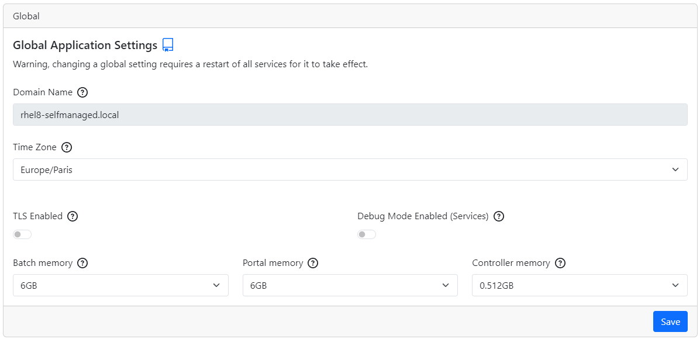

# Identity Analytics configuration interface

## First connection

To access the configuration page navigate to `<hostname>/config`, If not logged in you will be redirected to the login page.

Connect using the default `setup` account and update your password.

Once logged in you will be redirected to the configuration home page which displays the configuration sections and warnings. Click on each section to go to the corresponding configuration page.  

> [!warning] Do not forget to click on `Save` to make your changes effective. If you navigate to a new page before clicking save you will loose all applied configuration.

We recommend to restart the service after each configuration section to isolate possible errors.

## Header Menu

### Change language

You can change the language of the configuration interface by clicking on the language icon `fr` or `en` in the header menu.

### Restart services

You can restart the services by clicking on the restart icon in the header menu.

Please note that this action will only restart the following services, if you require to restart a service not in the following list a stop/start through the CLI is necessary:

- `bwportal`
- `bwdatabase`
- `bwbrainwavedb`
- `bwauth`
- `bwcontroller`

> The restart of the services can take a few minutes. Only modified services will be restarted.

### Logout

You can logout by clicking on the logout icon in the header menu.

## Pages

### Home

This screen shows all the configuration sections and configuration warnings. If some settings are missing or incorrect, an orange box and a warning sign will appear. It also provides you with links to each configuration section.  

When you click on a configuration section, you will be redirected to the configuration page of this section.

Please note that:

- You need to click on `Save` to make your changes effective.
- You can't save an invalid configuration.
- For most settings, a service restart is required to make your changes effective.
- If a field is required or invalid, a red box and a warning will appear.
- if a password is missing, an orange box will surround the field.

### Global

- Domain name: The domain name of the server. It can **only** be changed through Identity Analytics CLI.
- Timezone: The timezone of the server.
- TLS enabled: Enable or disable TLS. If you activate TLS, you will have to provide a certificate and a key. Please refer to [SSL configuration page](ssl-configuration) for more information.
- Debug mode enabled: Enable or disable debug mode. This will add some logs for all services except portal. It shouldn't be used in production. Please refer to the [debug installation page](../installation/preface/#debug-options) for more information on this specific deployment.  
- Batch memory: The max memory allocated to the batch service.
- Portal memory: The max memory allocated to the portal service.
- Controller memory: The max memory allocated to the controller service (useful when uploading large files).

### Database

#### Internal

- Expose database: Expose the database port outside of the container.
- Exposure port: The port used to expose the database.
- Internal database password: The password of the database. Click on `Copy password` to copy the password in your clipboard.

#### External

- Database driver: The driver used to connect to the database. Please note that if you are using another database than postgres, you will have to provide the JDBC driver.
- Hostname: The hostname of the database.
- Port: The port of the database.
- Database name: The name of the database.
- Microsoft SQL Server allows the configuration of **JDBC connection string options:** Those options will be added to the end of JDBC connection string. It can be used to set some ssl parameters for example.
- Postgres allows the use of **auto init:**. If the database schema doesn't exist, it will be automatically created on startup of the system.

> [!important] For production environments it is recommended to create the required database schemas using the scripts provided in the artifact repository.  

- Reinitialize database: This button is only displayed the database was previously initialized. If you click on it, you will have to provide the passwords of the 3 schemas in order to reinitialize each one of them.  

> [!warning] This option will delete all the data in your schemas. Use at your own risk.  

- Usernames: The usernames used to connect to your different schemas.
- Passwords: The passwords used to connect to your different schemas.
- Schema name: The specific namespace within the database where tables, views, and other objects reside.

> When using a SQLserver database. The auditlog schema must be `igrc`, as a result it is not possible to change the value of this parameter.  

- Connection test: This button will test a user's connection to the external database. In order to test the connection, it uses the username you provided in the configuration page and it asks you for a password. **The password you provide to test your connection isn't saved to your configuration!** Please note that the validity of the configured schemas name is not included in the test.

### Git project

> [!warning] Upon first connection to the `/config` endpoint it is necessary to finalise the configuration by updating the `Username` and the connection password.

#### Without proxy

- Git project URL: The URL of the git project.
- Branch: The branch of the git project.
- Username: The username used to connect to the git project.
- Password: The **access token** used to connect to the git project.
- Project directory: the name of the project's directory in the **git repository**, by default `brainwave`:  
  
- Connection test: This button will test the connection to the specific branch of the git project with the provided credentials. It is highly recommended to test your connection before saving the configuration.
- Test and save: This button will test like the previous one and save the configuration if the test is conclusive. It ensures that a corrupted configuration is not saved.

#### With proxy

Enabling this option will route Git traffic through an HTTP proxy. Useful if accessing Git over a restricted network or to increase security.

- Use http proxy: Enable or disable the use of http proxy.
- Proxy host: The host of the proxy.
- Proxy port: The port of the proxy.
- Proxy requires authentication: Enable or disable the authentication to the proxy.
- Proxy username: The username used to connect to the proxy.
- Proxy password: The password used to connect to the proxy.

### Mail

#### SMTP Settings

- Enable email sending: Enable or disable the email sending.
- SMTP Domain Name: The domain name of the SMTP server.
- Port: The port of the SMTP server.
- Use SMTP authentication: Enable or disable the SMTP authentication.
- Username: The username used to connect to the SMTP server.
- Password: The password used to connect to the SMTP server.
- Sender email address: The email address used to send the emails.
- Sender name: The name used to send the emails.

#### Portal and Batch emails Settings

- Send portal and batch emails: Enable or disable the email sending by the portal and the batch.
- Redirect email to: The email address to which portal and batch emails will be redirected.
- Email subject prefix: The prefix of the email subject.
- Recipients in attachment: Enable or disable the recipients in attachment. If false, the receiver will not know who received the email other than him.
- Maximum number of emails per session: The maximum number of emails per session. If set to 0, there will be no limit.
- Split size (in megabytes): The split size in megabytes. If the size of the email is greater than the split size, the email will be split in multiple emails. This Field has to be formatted like this `numberM`. e.g `10M`, `4M`, `16M`. The recommended value is `5M`.

### Batch

- Technical configuration name: The name of the technical configuration used for the execution of the batch, the data ingestion.
- JVM configuration Options. JVM options tu use when running the Batch (the execution plan).

### Scheduling

#### Task automation settings

Here, you have the ability to configure whether a task is repeatedly executed and the frequency of those executions.

For each container (Batch, extraction and portal), you can configure the frequency on the left side of the box. On the right side of the box, you can see the corresponding cron expression. You can also choose to disable the task by clicking on the corresponding switch button.

> It is recommended to spread out the different scheduling to avoid overlap of the different actions. This is important in the case data ingestion that can take time to complete.

Secure portal stop timeout (ms): When the portal is stopped, it closes securely by allowing time for ongoing tasks to complete. This parameter sets the waiting time before forcing the portal to stop.

### Identity Data Management

- Identity Data Management LDAP URL : The url of the LDAP server
- Identity Data Management LDAP port : The port on which LDAP communication takes place
- Ping test : This button allows us to check if we can establish a connection with the LDAP server using the url and port provided.
- Identity Data Management LDAP username : The username used to connect to the LDAP server.
- Identity Data Management LDAP password : The password used to connect to the LDAP server.
- Authentication test : With this button we check if we can connect to the LDAP server with the provided information.

> For this part of the configuration, The information are saved only if the corresponding test is successful.

### Portal

- Enable portal debugging: Enable or disable debug mode in the portal. This provides the debug context within the pages. It isn't recommended for production environments.

## Uploads

This page allows you to upload your license file.

> The license file has to contain `.lic` extension. (e.g. `license.lic`)

If a license file is already uploaded, you can delete it by clicking on the `Delete` button.
