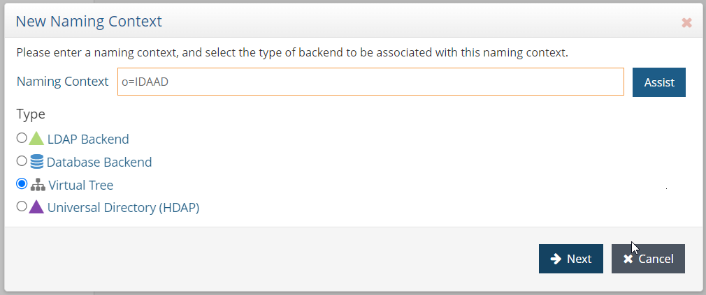

# Identity Data Management Integration

The following documentation will provide the user with the requirements Configuring Sources and Views in RadiantOne Identity Data Management for consumption by RadiantOne Identity Analytics.  

Radiant Logic provides two products that operate in the Identity Data space, Identity Data Management (IDDM) and Identity Analytics (IA). This documentation provides instructions on the creation and configuration of Views in IDDM specifically to facilitate the integration of the identity data staged in the IDDM Views into the IDA data repository with a minimum of configuration on the IDA product.  

Currently the following data sources in IDDM are supported for direct View integration in IA:

- Active Directory domains – Users and Groups
- LDAP directories – Users and Groups

## IDDM pre-requisites

IDA requires a certain configuration of the data in IDDM to allow the seamless extraction and collection of data. The following sections will provide the user with the required configuration for Active Directory and LDAP backends.  

### Active Directory backend configuration

The Active Directory domain backend should have been configured in the IDDM control panel. To create the required hierarchy in IDDM please follow these steps:  

- In the "Directory Namespace" tab create a new naming context `o=IDAAD` based on a virtual tree.

- In the newly created root Create a label. The label type must be `dc`and the name  

- Configure the mapping of the backend in the label. Select an LDAP backend mapping and point to the desired data source as the backend  

- Remove the DN remapping option for all attributes  

To validate the configuration please check the the directory browser that:

- The label is correctly named `dc=XXXX`  
- The attribute `objectClass=domain` is present for the label  
- That the users and groups are present  

### LDAP backend configuration

The LDAP backend should have been configured in the IDDM control panel. The configuration is similar to the configuration for the Active Domain backend. To create the required hierarchy in IDDM please follow these steps:  

- In the "Directory Namespace" tab create a new naming context `o=IDALDAP` based on a virtual tree.

- In the newly created root Create a label. The label type must be `dc` and the name  

- Configure the mapping of the backend in the label. Select an LDAP backend mapping and point to the desired data source as the backend  

- Remove the DN remapping option for all attributes  

To validate the configuration please check the the directory browser that:

- The label is correctly named `dc=XXXX`  
- The attribute `objectClass=dcObject` is present for the label  
- That the users and groups are present  

## Declaring the Datasource in Identity Analytics

Once inside the Identity Analytics Portal, expand the left menu and select the *Configure* option in the *Datasource Management* Section

In this section we can see the list of datasources if any has been declared. The list will be empty if no datasource has been declared. Click on the *Add* button to declare a new datasource.

A wizard to declare a new datasources will pop up including default configurations for the connection to RadiantOne IDDM:

- RadiantOne - Active Directory  
- RadiantOne - Generic LDAP  
- RadiantOne - Generic Bridge  

Each datasource requiring a sightly different configuration:  

### RadiantOne - Active Directory

This connector is to be used when connecting to an Active directory backend in Identity Data Manager.  

Fill out the required field, for example:

- Datasource Name: o=IDAAD
- Datasource description: Extraction of all AD domains included in the root naming context of o=IDAAD

The Options are configured by default and no modification is required. You can adjust your search filter to limit the data extraction.  

> It is of course possible to change the parameters to correspond to your data structure in Identity Data Manager. Please keep in mind that the `dc` attribute is required.

Follow the wizard for the final steps.  

### RadiantOne - Generic LDAP

This connector is to be used when connecting to a generic LDAP backend in Identity Data Manager.  

Fill out the required field, for example:

- Datasource Name: o=IDALDAP
- Datasource description: Extraction of all AD domains included in the root naming context of o=IDLDAP

The Options are configured by default and no modification is required. You can adjust your search filter to limit the data extraction.  

> It is of course possible to change the parameters to correspond to your data structure in Identity Data Manager. Please keep in mind that the `dc` attribute is required.

Follow the wizard for the final steps.  

### RadiantOne - Generic Bridge

This connector is to be used when using the datasoucrs connector as a bride between Identity Data Manager and Identity Analystics.

> This connector requires the configuration of a dedicated collector line to leverage the input files.  

After clicking on Next, provided the required information in order to connect to the Identity Data Management LDAP URL. We will find:

- **LDAP Server URL**
- **Login**
- **Password**
- **Search base** used for the data extraction
- **Search filter** used to select the LDAP objects that will be extracted
- **Attributes** to extract, leave this empty to extract all available attributes  

Click on Next to schedule the extraction. You can for example extract data once a week or every day.

Click on *Next* for to reach the last step of the wizard and then *Finish* to confirm the datasource declaration.

## Declaring Multiple Datasources

If we have multiple Identity Data Management URLs or different *Search Bases* to extract, you can repeat the process to declare one datasource by URL or by *Search Base*. Keep in mind that each datasource must have a unique datasource name.

## Testing the Data Extraction

Each declared datasource will have a corresponding connector created in the Controller.

You can reach the Controller using the URL `/controller`. Then click on the *Connectors* item in the menu that you will find on the left.

Click on the connector to see more details.

From here, you can use the button *Submit a new test execution*, this will trigger the data extraction process. It will take a few minutes.

When the data extraction test process has finished, the details page will automatically refresh to display the test results.

You can download the test results to verify the extracted files.  

For more information on the controller pleaser refer to the dedicated documentation:

[Controller](../containers/controller)
